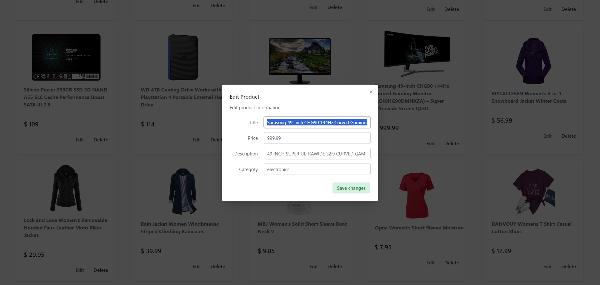

# Week-3

This repository contains the code for Week 3 of the project. It is built using:
- React
- TypeScript
- Vite

To start the development server, you can use either of the following commands:
`yarn run dev`
or
`npm run dev`

### Screens of the app

- Product List Page

 
- Edit Product

